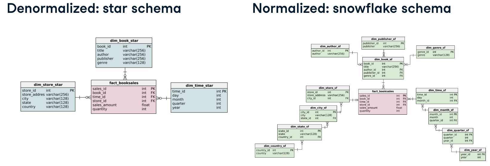

# Database Design

Moving from writing queries to designing the structure that queries run against: table constraints and keys, OLTP vs. OLAP, dimensional modeling (star/snowflake schemas), and normalization.

---

## 1. Table structure and constraints

**Create and alter tables**

- Create tables: 
```sql
CREATE TABLE table_name (
  column_a data_type,
  column_b data_type
);
```

- `ALTER TABLE`: to add/rename/drop a column
```sql
ALTER TABLE table_name
ADD COLUMN column_name data_type;

ALTER TABLE table_name
RENAME COLUMN col_old TO col_new;

ALTER TABLE table_name
DROP COLUMN column_name;
```

**Add data into a new table**
- INSERT records INTO the new table
```sql
INSERT INTO table_name (column_a, column_b)
	VALUES (value_a, value_b);
```

- Migrate data from existing tables (and deduplicate):
```sql
INSERT INTO new_table
SELECT DISTINCT column_name1, column_name2 -- use DISTINCT to deduplicate
FROM original_table;
```

**Update data type/values after creation:**

- Alter data type, with an optional transformation via `USING`:

```sql
ALTER TABLE table_name
ALTER COLUMN avg_grade TYPE INTEGER
  USING ROUND(avg_grade);
```

- Update values\: `SET`
```sql
UPDATE table_name SET column_name = ROUND(column_name, 2)

-- Update values based on another table
UPDATE table_a SET column_x = table_b.y 
FROM table_b 
WHERE <condition1> AND <condition2> AND ...;
```

*Eg*, set `professor_id` to `professors.id` where firstname and lastname correspond to rows in professors
```sql
UPDATE affiliations
SET professor_id = professors.id
FROM professors
WHERE affiliations.firstname = professors.firstname
  AND affiliations.lastname = professors.lastname;
```

### Integrity constraints

Types: **attribute constraints** (data types, NOT NULL, UNIQUE), **key constraints** (primary keys), and **referential integrity constraints** (foreign keys)

**(1) NOT NULL and UNIQUE**

`NULL` can mean *unknown*, *doesn't exist*, or *doesn't apply*, so two `NULL`s should NEVER be treated as equal ⇒ comparing `NULL = NULL` always evaluates to `FALSE`

```sql
CREATE TABLE students (
	stu_id INTEGER UNIQUE NOT NULL,
	lastname varchar(64) NOT NULL,
	phone_home INTEGER, -- could be 'unknown'
	phone_office INTEGER -- could be 'not apply'
);
```

- Add / Remove a NOT NULL constraint: `SET NOT NULL`, `DROP NOT NULL`

```sql
-- After the table has been created
ALTER TABLE table_name
ALTER COLUMN col_name SET NOT NULL;

ALTER TABLE table_name 
ALTER COLUMN col_name DROP NOT NULL;
```

- Unique constraints: `ADD CONSTRAINT`
```sql
-- When creating a table
CREATE TABLE table_name ( col_a UNIQUE); 

-- Add to an existing table 
ALTER TABLE table_name 
ADD CONSTRAINT constraint_name UNIQUE(col_a);
```

**(2) Primary keys & Key constraints** 

Superkey: a set of attributes that uniquely identifies a row within a table, ensuring data integrity
Key (or minimal superkey): a superkey with no removable attributes left

- Specify PK when creating tables:
```sql
CREATE TABLE table_name (
  col_id integer PRIMARY KEY,
  col_x text
);

-- Composite primary key
CREATE TABLE table_name (
  col_a integer,
  col_b integer,
  PRIMARY KEY (col_a, col_b)
);
```

- Add PK constraints to existing tables: `ADD CONSTRAINT`
```sql
ALTER TABLE table_name
ADD CONSTRAINT <constraint_name> PRIMARY KEY(col_name)
```

**Surrogate key**: an artificial primary key added purely to serve as one, commonly a `serial` column
- Add a surrogate PK with `serial`data type (auto-increments and rejects duplicates):
```sql
ALTER TABLE table_name
ADD COLUMN id serial PRIMARY KEY;
```

>After adding the `serial` column, whenever we add a new record to the table, it’ll automatically get a number. Also, if we try to specify an ID that already exists, the primary key constraint will prevent us from doing so.

- Add a surrogate PK from existing columns:
```sql
ALTER TABLE table_name
ADD COLUMN col_c varchar(256);

UPDATE tabel_name
SET col_c = CONCAT(col_a, col_b);
ALTER TABLE table_name
ADD CONSTRAINT pk PRIMARY KEY (col_c);
```


**(3) Foreign keys & Referential integrity**

**Implement 1:N relationships with foreign keys**
**Foreign keys** point to another table's primary key

```sql
CREATE TABLE table_a (
  a_id varchar(255) PRIMARY KEY,
  xyz varchar(255) REFERENCES referenced_table (r_pk)
);

ALTER TABLE table_a
ADD CONSTRAINT fk_name FOREIGN KEY (b_id) REFERENCES referenced_table (id);
```
After specifying the Foreign Key, only records with valid and existing foreign keys can be entered into that table.

**Implement N:M relationships:** 
create a new table → add a foreign key to each connected table → add any extra attributes. 
```sql
CREATE TABLE affiliations (
	professor_id integer REFERENCES professors (id),
	org_id varchar(256) REFERENCES organizations (id),
	function varchar(256)
);
```
No single primary key is required; the combination of multiple foreign keys often serves as one.

For existing tables: specify an existing column to be a FK → add a new column as FK, then populate it based on values in another table
```sql
ALTER TABLE affiliations
ADD CONSTRAINT aff_organization_fk FOREIGN KEY (organization_id) REFERENCES organizations (id);

-- Add a professor_id column as a foreign key that references the id column in professors 
ALTER TABLE affiliations
ADD COLUMN professor_id integer REFERENCES professors (id);
-- Update professor_id to professors.id where firstname, lastname correspond to rows in professors
UPDATE affiliations
SET professor_id = professors.id
FROM professors
WHERE
	affiliations.firstname = professors.firstname
	AND affiliations.lastname = professors.lastname;
```

**Foreign key constraints** (or **Referential integrity**): each value of the foreign key must exist in the Primary Key of the other table (ie, a record in table A cannot point to a record in table B that doesn’t exist)

**Handling foreign key violations** (Tell the database system what should happen if a referenced row is deleted):

```sql
CREATE TABLE a (
	id integer PRIMARY KEY,
	col_a varchar(64),
	...,
	b_id integer REFERENCE b (id) ON DELETE NO ACTION
);
```

| Behavior                        | Effect                                                                     |
| ------------------------------- | -------------------------------------------------------------------------- |
| `ON DELETE NO ACTION` (default) | throws an error                                                            |
| `ON DELETE RESTRICT`            | throws an error (near-identical to `NO ACTION` but different in technical) |
| `ON DELETE CASCADE`             | allows the deletion, and deletes the referencing rows too                  |
| `ON DELETE SET NULL`            | sets the referencing column to NULL                                        |
| `ON DELETE DEFAULT`             | sets the referencing column to its default value                           |
Change the referential integrity behavior of a key:
```sql
-- Check all the constraint names
SELECT constraint_name, table_name, constraint_type
FROM information_schema.table_constraints
WHERE constraint_type = 'FOREIGN KEY';

-- Drop the right foreign key constraint
ALTER TABLE affiliations
DROP CONSTRAINT affiliations_organization_id_fkey;

-- Add a new FK constraint from affiliations to organizations which cascades deletion
ALTER TABLE affiliations
ADD CONSTRAINT affiliations_organization_id_fkey
  FOREIGN KEY (organization_id) REFERENCES organizations (id) ON DELETE CASCADE;
```

---

## 2. Processing, Storing, and Organizing Data

### OLTP vs. OLAP

|                | OLTP (Transaction Processing)               | OLAP (Analytical Processing)                          |
| -------------- | ------------------------------------------- | ----------------------------------------------------- |
| Focus          | day-to-day operations: find, insert, update | business decision-making                              |
| Data           | up-to-date, operational                     | consolidated, historical                              |
| Normalization  | highly normalized                           | less normalized                                       |
| Typical system | operational database (eg, app database)     | data warehouse (eg, Amazon Redshift, Google BigQuery) |
| Priority       | fast, safe inserts (write-intensive)        | fast queries for analysis (read-intensive)            |

### Structuring data

| Level | Follows a schema? | Trade-off | Examples |
|---|---|---|---|
| Structured | yes, predefined | easiest to analyze | SQL tables |
| Semi-structured | ad-hoc, self-describing | more flexible | JSON, XML, NoSQL |
| Unstructured | no schema at all | most flexible/scalable | photos, audio, chat logs |

### Where structured data lives

- **(Traditional) databases** : relational, structured data, OLTP, schema-on-write (schema is fixed before data arrives)
- **Data warehouse** : archived structured data, OLAP, schema-on-write
  -Optimized for read-only analysis;
  -Combines data from multiple sources using massively parallel processing (MPP);
  -Typically uses a denormalized, dimensional schema
	- **Data mart**: a topic-specific subset of a warehouse
- **Data lake** : all data types, schema-on-read (schema is applied only when the data is read).
  -Cheaper storage for raw/operational/IoT data, suited to big-data analytics and deep learning.

**Data flows** (how data will get there and in what form): **ETL vs. ELT** 
- ETL (transform before loading): the traditional approach for data warehouses and smaller-scale analytics
- ELT (transform after loading): more common for big-data pipelines feeding data lakes

### Data modeling: three levels

1. **Conceptual**: what the database contains, such as its entities, relationships, attributes
2. **Logical**: how those entities and relationships map to actual tables and columns
3. **Physical** : how the data is physically stored

A **dimensional model** is built from two table types: **fact tables** and **dimension tables** (connected by foreign keys)
- Fact tables: decided by business use-case, hold records, change regularly
- Dimension tables: hold descriptions of attributes, do not change often

---

## 3. Star and snowflake schemas

- **Star schema**: one fact table connected directly to several dimension tables. Simple, one layer of dimensions.
- **Snowflake schema**: an extension of the star schema where the dimension tables are themselves normalized into further sub-dimensions (eg, splitting a `country` dimension into `country` → `continent`).



- Create a foreign key in an existing table:
```sql
ALTER TABLE fact_table
ADD CONSTRAINT constraint_name FOREIGN KEY (foreign_key) REFERENCES dim_table(primary_key);
```

- Extend the dimension (Normalization):
```sql
-- Create dim_author table with an author column
CREATE TABLE dim_author (
  author VARCHAR(256) NOT NULL
);

INSERT INTO dim_author
SELECT DISTINCT author FROM dim_book_star;

-- Add a primary key to the new dimensional table
ALTER TABLE dim_author ADD COLUMN author_id SERIAL PRIMARY KEY;

-- Output the new table
SELECT * FROM dim_author;
```

- Link a new sub-dimension with a foreign key (snowflaking)
```sql
-- Add a continent_id column with default value of 1
ALTER TABLE dim_country_sf
ADD continent_id int NOT NULL DEFAULT(1);

ALTER TABLE dim_country_sf
ADD CONSTRAINT country_continent FOREIGN KEY (continent_id) REFERENCES dim_continent_sf(continent_id);
```

---

## 4. Normalization

**Normalization**: a technique that divides tables into smaller tables and connects them via relationships (foreign keys). 
-Goal: to reduce redundancy (save space), increase data integrity (consistency, easier to redesign by extending)
-How to normalize: identify repeating groups of data and create new tables for them

**Normalization vs. denormalization** mirrors OLTP vs. OLAP: 
- OLTP: write-intensive, prioritize quicker & safer insertion of data ⇒ highly normalized
- OLAP: read-intensive, prioritize quicker queries for analysis ⇒ less normalized

### Normal forms

**1NF**: every record is unique (NO duplicate rows), and every cell holds exactly one and only one value (no repeating groups within a cell)

**2NF**: must satisfy 1NF, and:
-if the primary key is a single column, the table is automatically 2NF;
-if the primary key is composite, every non-key column must depend on *all* parts of the key (NO partial dependencies)

Converting to 2NF: 
```sql
-- car_id is the PK, but model/manufacturer only depend on car_id, not on any composite key, so this violates 2NF as-is until split out
-- 1. Create a new table to satisfy 2NF
CREATE TABLE cars (
  car_id VARCHAR(256) NULL,
  model VARCHAR(128),
  manufacturer VARCHAR(128),
  type_car VARCHAR(128),
  condition VARCHAR(128),
  color VARCHAR(128)
);

-- 2. Insert data into the new table
INSERT INTO cars
SELECT DISTINCT car_id, model, manufacturer, type_car, condition, color
FROM customer_rentals;

-- 3. Drop columns in customer_rentals to satisfy 2NF
ALTER TABLE customer_rentals
DROP COLUMN model,
DROP COLUMN manufacturer,
DROP COLUMN type_car,
DROP COLUMN condition,
DROP COLUMN color;
```

**3NF**: must satisfy 2NF, and no transitive dependencies (a non-key column can't depend on another non-key column)

Converting to 3NF: 
```sql
-- manufacturer and type_car depend on model, a non-key column, not on the table's own primary key directly, so they're pulled into their own table
CREATE TABLE car_model (
  model VARCHAR(128),
  manufacturer VARCHAR(128),
  type_car VARCHAR(128)
);

ALTER TABLE rental_cars
DROP COLUMN manufacturer,
DROP COLUMN type_car;
```

#### Why it matters: to avoid data anomalies

- **Update anomaly**: the same fact is stored in multiple rows, so updating it in one place but not others creates data inconsistency
- **Insertion anomaly**: a record can't be added because unrelated attributes are unintentionally required by the table's structure
- **Deletion anomaly**: deleting one record unintentionally deletes other data bundled into the same row

The more normalized the database, the less prone it’ll be to data anomalies. (Most 3NF tables don’t have update, insertion, and deletion anomalies)

---

## Quick reference: which do I need?

- **Deciding if a design should favor writes or reads**: OLTP (writes) vs. OLAP (reads)
- **Storing raw data of any type cheaply**: data lake
- **Storing curated, structured data for analysis**: data warehouse
- **Modeling facts and dimensions for a warehouse**: star schema (simple) or snowflake schema (further-normalized dimensions)
- **Reducing redundancy and inconsistency risk**: normalize toward 3NF
- **Diagnosing why an insert/update/delete feels fragile**: check for the matching anomaly, then normalize further

---
*Part of my [SQL notes](./README.md), written during upskilling in data analytics*
