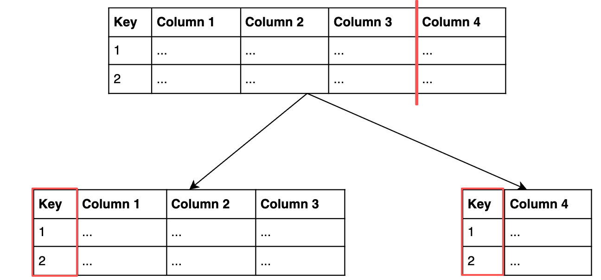
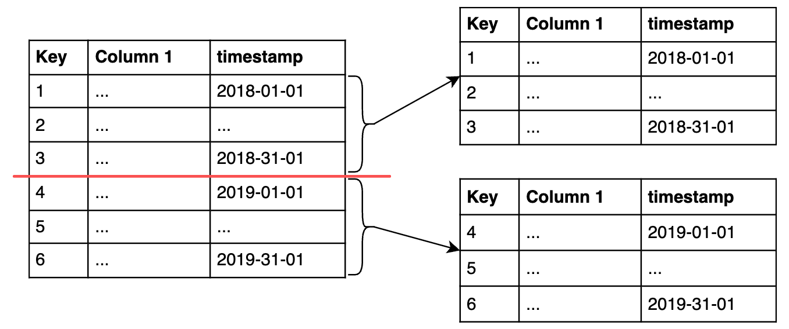

# Views, Roles & Table Partitioning

Database management topics that sit above individual queries: views for reusable/access-controlled query logic, roles for permissions, table partitioning for splitting large tables, and a quick tour of DBMS types.

---

## 1. Views

A **view** is a virtual table: it stores the *query*, not the data ⇒ takes up no extra storage and always reflects the current state of the underlying tables. It can be queried like a regular table.

**Why use one**: access control (expose only certain columns to certain users) and hiding query complexity, especially useful on a highly normalized schema where "one real answer" needs several joins.

**CREATE a VIEW:** add a line before the query to name the view

```sql
CREATE VIEW view_name AS
SELECT col_1, col_2
FROM table_name
WHERE condition;
```

**Listing views** (PostgreSQL): (`information_schema.views` includes system built-in views)

```sql
SELECT * FROM information_schema.views
WHERE table_schema NOT IN ('pg_catalog', 'information_schema');
```

**Managing Views**
- **Granting and revoking access:**

```sql
GRANT SELECT ON view_name TO role_name;
REVOKE SELECT ON view_name FROM role_name;
```

Privileges (`SELECT`, `INSERT`, `UPDATE`, `DELETE`, etc.) are granted `ON` an object (table, view, schema) `TO`/`FROM` a role (a specific user, or `PUBLIC` for everyone).

- **Updating a view:**
```sql
UPDATE view_name SET col_a = 'y' WHERE col_a = 'x';
```
Updating through a view **actually updates the underlying table**, so not every view supports it: only views built from *a single table*, with *NO window or aggregate function*, are updatable or insertable.

- **Dropping a view**:

```sql
DROP VIEW view_name [RESTRICT | CASCADE];
```

`RESTRICT` (default): returns an Error if anything depends on the view.
`CASCADE` drops the view and everything that depends on it too.

- **Redefining a view** (change the query the view is defined by):

```sql
CREATE OR REPLACE VIEW view_name AS new_query;
```

1. If a view with `view_name` exists, it’ll be replaced
2. **Criteria**: the new query must return the same column names, order, and data types as before (the column output can be different; new columns can be appended at the end). 
3. If the criteria can't be met, PostgreSQL drops the old view and creates a new one instead.

- **Altering a view**: (changing auxiliary properties, *eg*, name, owner, schema of a view)
```sql
ALTER VIEW [ IF EXISTS ] name ALTER [ COLUMN ] col_name SET DEFAULT expression
ALTER VIEW [ IF EXISTS ] name ALTER [ COLUMN ] colname DROP DEFAULT
ALTER VIEW [ IF EXISTS ] name OWNER TO { new_owner | CURRENT_ROLE}
ALTER VIEW [ IF EXISTS ] name RENAME TO new_name
ALTER VIEW [ IF EXISTS ] name RENAME [ COLUMN ] col_name TO new_colname
ALTER VIEW [ IF EXISTS ] name SET SCHEMA new_schema
ALTER VIEW [ IF EXISTS ] name SET ( view_option_name [= view_option_value] [, ... ] )
ALTER VIEW [ IF EXISTS ] name RESET ( view_option_name [, ... ] )
```

### Materialized views

**Materialized view** stores the query *results* on disk. 
- Querying it reads the stored result directly rather than re-running the query each time, so it's faster but can go stale; 
- Materialized views will be refreshed or rematerialized (the query is run and the stored query results are updated) when prompted;
- Particularly useful in Data Warehouse (OLAP) (because OLAP is not write-intensive → less worry about out-of-date data)

Create & Refresh materialized views:
```sql
CREATE MATERIALIZED VIEW my_mv AS
SELECT * FROM existing_table;

REFRESH MATERIALIZED VIEW my_mv;
```

>Watch out for dependency chains: materialized views often depend on other materialized views ⇒ refreshing several materialized views all at once isn't efficient.

---

## 2. Database roles

Roles (**user roles** and **group roles**) are global across an entire database cluster, not scoped to a single database.

**Creating a role:**
- **Attributes** define some (but not all) of what the roles can do → we can set some attributes when creating a role (*eg*, `password`, `valid until` date)
- To change an attribute for an already created role, we use the `ALTER` keyword
```sql
-- Empty role
CREATE ROLE data_analyst;

-- Roles with attributes set at creation
CREATE ROLE intern WITH PASSWORD 'PasswordForIntern' VALID UNTIL '2027-01-01';
CREATE ROLE admin CREATEDB;

-- Changing an attribute on an existing role
ALTER ROLE admin CREATEROLE;
ALTER ROLE intern WITH PASSWORD 's3cur3p@ssw0rd';
```

**Granting and revoking privileges**:

```sql
GRANT UPDATE ON ratings TO data_analyst;
REVOKE UPDATE ON ratings FROM data_analyst;
```

Available privileges in PostgreSQL: `SELECT`, `INSERT`, `UPDATE`, `DELETE`, `TRUNCATE`, `REFERENCES`, `TRIGGER`, `CREATE`, `CONNECT`, `TEMPORARY`, `EXECUTE`, `USAGE`.

**Adding a user role to a group role**:

```sql
GRANT group_role TO user_role;
```

---

## 3. Table partitioning

Splitting a table into smaller physical pieces, part of the *physical* data model.

**Vertical partitioning** splits by *columns*, useful for separating rarely-used or large columns (*eg*, a long text field) from the rest of the table:



Creating vertical partitions: create a new table with particular columns → copy the data there using `INSERT INTO new_table` → then drop the columns we want in the separate partition

```sql
-- Create a new table
CREATE TABLE film_descriptions (
  film_id INT,
  long_description TEXT
);

-- Copy the descriptions from the film table (INSERT INTO)
INSERT INTO film_descriptions
SELECT film_id, long_description FROM film;

-- Drop the descriptions from the original table
ALTER TABLE film DROP COLUMN long_description;

-- Rejoin when needed
SELECT * FROM film
JOIN film_descriptions USING(film_id);
```

**Horizontal partitioning** splits by *rows*, *eg*, by timestamp. 


In PostgreSQL, this is done through **declarative partitioning**:
1. Add `PARTITION BY` to the table definition, 
	- Range partition: `PARTITION BY RANGE (column)`;
	- List partition (forming partitions by checking whether the partition key is in a list of values or not): `PARTITION BY LIST (column)`
2. Create each partition with `PARTITION OF new_table`, specifying the range or list values it should hold.
3. Add an index on the partitioning column.

- *Eg, List Partition:*
```sql
-- Create a new table
CREATE TABLE film_partitioned (
  film_id INT,
  title TEXT NOT NULL,
  release_year TEXT
)
PARTITION BY LIST (release_year);

-- Create the partitions for 2019 and 2018
CREATE TABLE film_2019
  PARTITION OF film_partitioned FOR VALUES IN ('2019');
CREATE TABLE film_2018
  PARTITION OF film_partitioned FOR VALUES IN ('2018');

-- Insert the data into film_partitioned
INSERT INTO film_partitioned
SELECT film_id, title, release_year FROM film;

-- View film_partitioned
SELECT * FROM film_partitioned;
```

- *Range partition:*
```sql
CREATE TABLE sales (
  ...
  timestamp DATE NOT NULL
)
PARTITION BY RANGE (timestamp);

CREATE TABLE sales_2019_q1 PARTITION OF sales
	FOR VALUES FROM ('2019-01-01') TO ('2019-03-31')
...
CREATE INDEX ON sales ('timestamp')
```

---

## 4. Deleting data: DROP vs. TRUNCATE vs. DELETE

- Remove a table: `DROP TABLE table_name;` ⇒ removes the entire table, including structure
- Clear **all records** in a table: `TRUNCATE TABLE table_name;` ⇒ removes all rows, keeps the table structure
- Remove selected records: `DELETE FROM table_name WHERE ...;` ⇒ only removes rows matching the condition

---

## 5. DBMS (Database Management System)

DBMS: System software for creating and maintaining databases, serves as an interface between the database and end users or application programs.

DBMS manages three things: (1)the data itself, (2)the schema, (3)the database engine that controls access, locking, and modification.

DBMS types:
- **SQL DBMS** (or Relational Database Management System, **RDBMS**): based on the relational model of data, best for fixed structures that don't need frequent schema changes, strong data integrity 
- **NoSQL DBMS** (Non-relational DBMS): less structured, document-centered rather than
  table-centered. Falls into four common types:
	- **Key-value store**
	- **Document store**: similar to key-value but documents are stored as values, good for content management  (eg, MongoDB)
	- **Columnar database**: each column stored separately, scalable and fast for large volumes of time-series data (eg, Cassandra)
	- **Graph database**: data modeled as interconnected nodes, capable of lots of complexity, common in social networks (eg, Neo4j)

---

## Quick reference: which do I need?

- **Reuse a common query, or hide columns from some users**: a view
- **Same as above, but the query is slow and freshness isn't critical**: a materialized view
- **Control who can do what**: roles + `GRANT`/`REVOKE`
- **A table has grown too large or has a rarely-used wide column**: vertical partitioning
- **A table needs to be split by date, region, or category for performance**: horizontal (declarative) partitioning
- **Removing data**: keep the table → `DELETE` (some rows) or `TRUNCATE` (all rows); remove the table entirely → `DROP`

---
*Part of my [SQL notes](./README.md), written during upskilling in data analytics*
