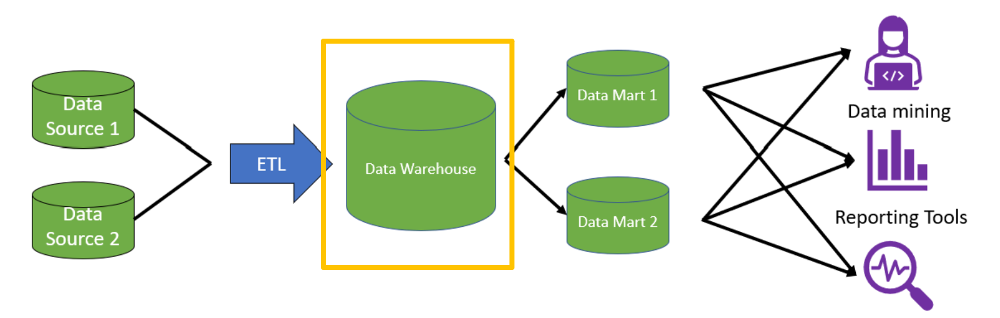
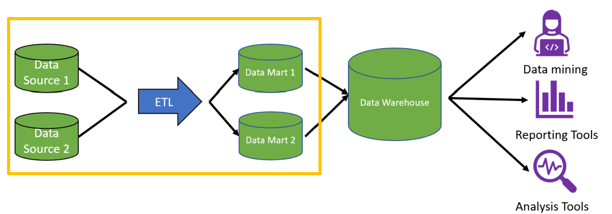

# Snowflake SQL & Data Warehousing Concepts

The concepts behind why cloud data warehouses like Snowflake are built the way they are, and the specific syntax differences between PostgreSQL and Snowflake.

---

## 1. Warehouse, mart, or lake?

- **Data warehouse**: gathers and integrates data, making it available for analysis.
- **Data mart**: a relational database focused on one subject area, a slice of the warehouse.
- **Data lake**: an organization-wide store for data of any structure.

| | Data Warehouse | Data Mart | Data Lake |
|---|---|---|---|
| Data structure | Structured | Structured | Structured & unstructured |
| Complexity to change | Complex (upstream/downstream impact) | Complex | Less complex |
| Purpose of data | Known | Known | May not be known |
| Department coverage | Many | One | Many |
| Data sources | Many source systems | Few sources | Many source systems |
| Typical size | > 100 GB | < 100 GB | > 100 GB |

---

## 2. Warehouse architectures: top-down vs. bottom-up

**Top-down (Bill Inmon)**: data enters the warehouse in *normalized* form.
The organization has to agree upfront on naming, definitions, and which data wins when sources conflict; all data cleaning operations done before the data enters the warehouse.


**Bottom-up (Kimball)**: starts by modeling a single department or business process into a data mart, denormalizing into a star schema.
Data moves directly from ETL into the mart, department by department, rather than into one central normalized warehouse first.


### Kimball's four-step design process

1. Select the organizational process for creating a data model;
2. Decide the **grain** (ie, the level of detail stored per fact row): prefer the lowest level that can't be split further;
3. Identify the dimensions: common dimensions are like Time (year, quarter, month), Location (address, state, country), Users (name, e-mail address);
4. Identify the facts, the numerical measurements for each row.

---

## 3. Row store vs. column store

| | Row store | Column store |
|---|---|---|
| Storage | rows stored together in blocks | columns stored together in blocks |
| Strength | easy to add new rows | queries only the columns needed |
| Best for | transactional workloads (OLTP) | analytical workloads (OLAP) |
| Compression | standard | better, each block holds one data type |

Snowflake, like most modern warehouses, is a *columnar store*, which is why it's built for analytical (OLAP) queries rather than high-frequency transactional writes.

---

## 4. Snowflake SQL: syntax differences from PostgreSQL

Snowflake SQL is close to PostgreSQL with a few practical differences:

**Data types**
- `NUMBER(p, s)`: equivalent to `NUMERIC` in PostgreSQL, `p` = precision (total digits), `s` = scale (decimal digits).
- `TIMESTAMP_LTZ`: stores date and time with the local time zone, no direct PostgreSQL equivalent.
- Check a table's data types: `DESC TABLE table_name`
- Type conversion: `CAST()`, `::`, `TO_VARCHAR()`, `TO_DATE()`, same as PostgreSQL
- Extract a date part: `EXTRACT(field FROM date/time)` works the same, except day-of-week uses `weekday` as the field name instead of `dow` in PostgreSQL

**Grouping**
- `GROUP BY ALL` groups by every non-aggregated column in the `SELECT` automatically

**Joins**

- `NATURAL JOIN`: matches columns automatically by name and drops duplicate columns, no `ON` clause at all:

```sql
FROM table_1
NATURAL [INNER, LEFT, RIGHT] JOIN table_2  -- INNER by default

-- equivalent to
FROM table1
[INNER, LEFT, RIGHT] JOIN table2
ON table1.column_name = table2.column_name;
```

- `LATERAL JOIN`: allows a subquery within the FROM clause to access columns from a preceding table or view. The `LATERAL` keyword can be combined with any join type, or can be used as an implicit join:

```sql
-- Eg, pulling each account's most recent purchase
SELECT
  accounts.id,
  last_purchase.*
FROM accounts, LATERAL (
  SELECT *
  FROM purchases
  WHERE account_id = accounts.id
  ORDER BY created_at DESC
  LIMIT 1
) AS last_purchase;
```

**Semi-structured data (JSON)**

PostgreSQL uses `JSONB`;
Snowflake uses `VARIANT` ← supports both object (`'key': value`) and array structures.

- `PARSE_JSON(string)`: parses a JSON string into `VARIANT`
- Create JSON objects from key-value pairs: `OBJECT_CONSTRUCT('key_1', val_1, 'key_2', val_2, ...)`
- Query JSON data: use `:` to retrieve values from specific keys, *eg*, `SELECT column_name:key`
- Query nested keys: use `:` or `.` notations
	- Colons(`:`) separate each level of the nested JSON structure: `col_name:level1_key:level2_key`
	- Dot(`.`) starts with a `:` for the first level, then `.` for subsequent levels: `col_name:level1_key.level2_key`

```sql
SELECT business_id, name
FROM yelp_business_data
WHERE categories ILIKE '%Restaurant%'
  AND attributes:DogsAllowed ILIKE '%True%'
  AND attributes:BusinessAcceptsCreditCards ILIKE '%True%'
  AND city ILIKE '%Philadelphia%'
  AND stars > 4;
```

---

## Quick reference: which do I need?

- **Need one integrated, structured store for many departments**: data warehouse
- **Need a focused, single-subject slice of that**: data mart
- **Need to store raw or unstructured data cheaply, purpose TBD**: data lake
- **Designing fact/dimension tables from scratch**: Kimball's four-step process
- **Workload is mostly writes**: row store; **mostly analytical reads**: column store (what Snowflake uses)
- **Joining on identically-named columns with no `ON` clause**: `NATURAL JOIN`
- **Need each row matched against its own correlated subquery in FROM**: `LATERAL JOIN`
- **Querying JSON-like data in Snowflake**: `VARIANT` + `:` / `.` notation

---
*Part of my [SQL notes](./README.md), written during upskilling in data analytics*
